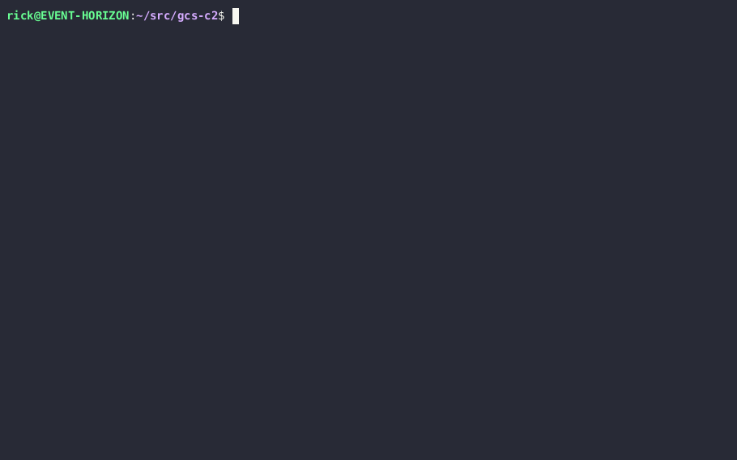

# gcs-c2
C2 over google cloud storage buckets



## Usage

### Requirements
Ensure that the following package is installed on both the victim and attacker:
```
$ pip install google-cloud-storage
```

Packages specific to the server:
```
$ pip install tabulate colorama
```

### Creating the infrastructure:
1. Create a private `bucket`
2. Create a new `role` that has the following permissions
    - `storage.buckets.get `	 	
    - `storage.objects.create` 	 	
    - `storage.objects.delete` 	 	
    - `storage.objects.get` 	 	
    - `storage.objects.list`
3. Create a new `service account` that has the new role
4. Create a new `key` for the service account and export it as JSON
5. Copy the JSON contents into the `info` variable inside the `client.py` and `server.py`

Once you have populated service account credentials and a bucket with read/write access, run `server.py` and `client.py` in any order. 

On the attacker:
```
$ python3 server.py
```

On the target:
```
$ python3 client.py
```

Once both are up, use the `help` menu for a list of available commands.